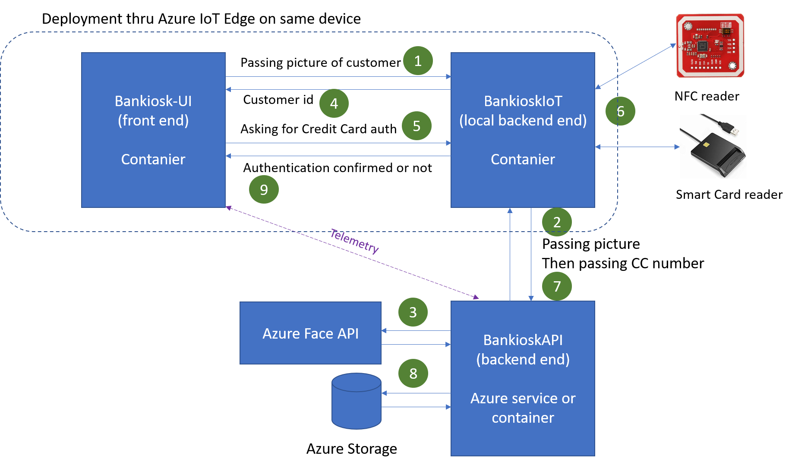
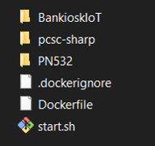

# BankiokIoT - SmartCard and NFC reader service for authentication

This project allows to get data from a credit card thru either a smart card reader either an NFC reader. This specific project supports any kind of smart card reader, under Linux, Windows or Mac. The supported NFC reader in this specific project is only the PN532 but as for the smart card reader, this can be easilly extended as shwon in the explanation below.

## Architecture

This section of the documentation focus mainly on the architure between the BankioskIoT component, the Bankiosk-UI and the BankioskAPI. We can summarize what is happening like this:



To describe the way the process is working:

 1. The UI detect someone and take a picture of the present customer, send this picture to BankioskIoT 
 2. BankioskIoT forward the picture to BankioskAPI
 3. BankioskAPI send the picture to the Azure Face API, if someone is detected, extract from the UserData the unique ID for the cutomer and forward back the answer to BankioskIoT
 4. BankioskIoT send back the answer to the UI. Information contains the customer unique ID, and it request as well from the API the customer name which is sent back to the UI.
 5. Bankiosk-UI ask the use the put his credit card in the reader or on the NFC reader and send the request to authenticate the user to BankioskIoT. The unique customer ID is passed in the request
 6. BankioskIoT is waiting for the card to be put in the/place on the NFC reader and read the data
 7. BankioskIoT send the customer unique ID and the credit card number to the BankioskAPI backend
 8. BankioskAPI is then checking the validify of the data in the data base, send back to BankkioskIoT
 9. BankioskIoT then send the result to the UI and add few more information picked from the card like the total number of transactions done as well as the number of pin tries left

No data are store in BankioskIoT.

 ## Technologies involved

The core technology used for this component is ASP.NET Core with .NET Core IoT and various compenents to support CreditCard reading thru NFC and Smart Card reader:

- [ASP.NET Core](https://docs.microsoft.com/en-us/aspnet/core/?view=aspnetcore-2.2)
- [.NET Core IoT](https://github.com/dotnet/iot)
- NFC Reader is a PN532 and is integrated in .NET Core IoT [GitHub](https://github.com/dotnet/iot). You can find the device [binding here](https://github.com/dotnet/iot/tree/master/src/devices/Pn532)
- [PCSC-sharp](https://github.com/danm-de/pcsc-sharp) which is a .NET wrapper over Peronal Computer/Smart Card recource managers wich works cross platform over Windows, Linux and Mac and supports .NET Core

## Building the project

You need to clone this project as well as the [PN352](https://github.com/dotnet/iot/tree/master/src/devices/Pn532) and [PCSC-sharp](https://github.com/danm-de/pcsc-sharp). And you need to make sure you create a directory where you'll place those 3 projects in this way:



Make sure to create the folder PN352 (in uppercase) and put in this folder the following folder:
* https://github.com/dotnet/iot/tree/master/src/devices/Pn532
* https://github.com/dotnet/iot/tree/master/src/devices/Common
* https://github.com/dotnet/iot/tree/master/src/devices/Card

You will also need to to add *System.Device.Gpio*. Navigate to the folder PN352/Pn352 and run the following command

```sh
> dotnet add package System.Device.Gpio --source https://dotnetfeed.blob.core.windows.net/dotnet-iot/index.json --version 1.0.0-prerelease.19413.1
```

The main BanikioskIoT project reference the 2 other projects.

**Notes: **

- once the device binding for .NET Core IoT will be updated to include the PN532, you won't need the reference on the project, you'll just have to update the Iot.Device.Bindings Nuget package.
- You will need to update both the System.Device.Gpio and Iot.Device.Bidings packages
- Then, you have to remove the PN532 project from the Dependencies

### Building the project for Windows

Just use Visual Studio, ctrl+shit+b will build it. The bin directory will contain all what you need.

#### Prerequires

You just need to have a compatible SmartCard reader for Windows. The PN532 will only work thru serial port. See the configuration section for more information.

### Building the project for Linux

use the following command line from the BankiokIIT/BankioskioT directory (where the BankioskIoT.csproj) is located:

```cmd
dotnet publish -r linux-arm -c Release
```

This will create a "publish" directory which you can copy to your Linux Arm32 device like a Raspberry Pi. In this case, once copied, change the execution rights for the file:

```bash
chmod +x ./BankioskIoT
```

To launch the program, just run ```./BankioskIoT```

#### Prerequires

You'll need to have the PCSC tools installed on your Linux machine:

```bash
sudo apt-get install -y --no-install-recommends pcscd libpcsclite1
```

This assumes you ar eusing a SmartCard reader which is using standard drivers. Refer to the PCSC documentation if you want support for other specific drivers.


You can use the PN532 thru any of the modes. If your target architecture supports I2C or SPI, make sure you'll have them activated. You can go as well for Hight Speed UART (hight speed serial port). In all cases, make sure you've activated them.

### Building the project for a Linux Arm32 container

You'll need to copy the 3 files from the picture below contained into the ```Docs``` directory of the project.


Place them as in the picture in the common directory where you've place the 3 projects. **Important**: don't place them in a common directory with hundreds of other directory, Docker would take hours to mount all the directories.

You will then need to build, tag and push your container.

```bash
docker build -t bankioskiot .
docker tag bankioskiot bankioskcontainersregistry.azurecr.io/bankiosk/iot:2
docker push bankioskcontainersregistry.azurecr.io/bankiosk/iot:2
```

Replace ```bankioskcontainersregistry``` by your own directory. Make sure as well to use the correct tag. You'll need it for Azure IoT Edge deployment.

On the device, to run the container if you want to make a test:
```bash
sudo docker run -it --privileged -p 1234:80 -e NONFC=smartcard bankioskcontainersregistry.azurecr.io/bankiosk/iot:2
```

This will run the continer and map the external port 1234 to the internal port 80. It will as well setup the environement variable NONFC to "smartcard" which will force the usage of the smart card reader. See the configuration section for more information. You will see any error message if anything bad happend at startup.

### Prerequires

You need to install at least Moby on your devide or any compatible Docker engine.

## Configuration

You can use environement variables or entries in the appsettings file for the configuration. The environement variables always take over the appsettings file.

Those are the core variables used:
- ```NFC_MODE_CONFIG```: should contain the serial port name like ```/dev/ttyS0``` on Linux or ```COM7``` on Windows
- ```NFC_MODE```: There are 3 possible options```HighSpeedUart```, ```I2c```, ```Spi```. this does select the operation mode for the PN532.
- ```NONFC```: There are 2 options: ```true```, ```smartcard```. If you set the mode to ```true```, this won't use neither the smart card reader neither the NFC reader. It's a developer mode which will always return something during the Credit Card authentication. ```smartcard``` mode allows to use the Smart Card reader and won't use the NFC reader.

You can on top use any of the ASP.NET Core environement variable like ```ASPNETCORE_URLS=http://+:1234``` to change the port the application is listening.

## Deploying thru Azure IoT Edge

You will need to install Azure IoT Edge on your device. Please refer to the [documentation here](https://docs.microsoft.com/en-us/azure/iot-edge/how-to-install-iot-edge-linux).

**Warning:** while running the following 2 installations, make sure to add -no-install-recommends:

```bash
sudo apt-get install moby-engine -no-install-recommends
sudo apt-get install moby-cli -no-install-recommends
```

Note that if you are running the latest Raspbian Buster version or any version based on Debuan 10, you'll need to install one more package. See [docuementation here](https://docs.microsoft.com/en-us/azure/iot-edge/support#tier-2)

```bash
sudo apt-get install libssl1.0.2
```

You can use the template [deployment.json](./Docs/deployment.json) as a template to create your own deployment templates. Please follow the steps by steps from the Azure IoT Edge docuementation if you are not familar with those templates. You can setup everything manually as well. Make sure you don't forget to add your spefic directory login, passwords and URL during the configuration.

Azure IoT Edge allow to programatically create an update existing deployement template. Those scenarios are very useful when connected with a build pipeline like in Azure DevOps. Those deployment templates allow as well to select some of the devices as target, replort success of deployment.

 ## Security concerns

 No data are stored in the BankkioskIoT service. In this implementation, the credit card number is passed to the BankioskAPI thru an https call which is encrypted. It is of course possible to pass a hash of the card rather than the full number. All the communications with the BankioskAPI are done thru https.
 
 Deployement is done in a container thru Azure IoT Edge. No keys or database connection as stored in anyway in the Bankiosk service. Then only keys present on the device are those to connect to the Azure IoT Service. Keyx which can be revocated at any moment.

 The BankioskIoT REST API is htpp and not https. This is a choice based on the fact that this is a pure demonstrator. That you can use https instead, you will need to deploy your own certificates into the device (or used self signed one). And no sensitive information is exchange thru this API. The container is running only on the device and can be setup to not be accessible from outside of the device.

## Other usage for this project

This project can be used with a bar code reader, to get authenticated with a fidelity card or with other types of RFID cards. Code whould have to be adjusted but the core principles will remain the same.