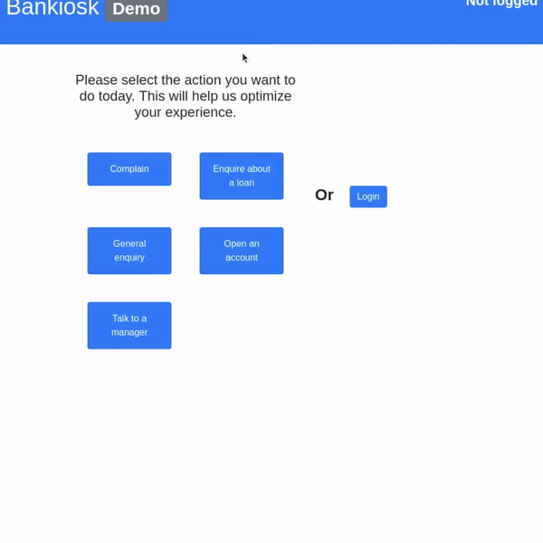

# Bankiosk:  Interactive kiosk for banks' branches

## The idea of Bankiosk

More and more banks are wondering how they could optimize their branches, making sure they have enough people to help customers.
In another hand, customers would want more optimization when entering a branch, to find out quicker where to wait and who to ask. 
The idea behind *Bankiosk* is to provide a starter kit to deploy kiosks in branches. 

This project started as a hack with all the contributors bellow. It is for the financial world, and it is about IoT and user experience!

## What it is

A kiosk would be a small PC (RaspberryPi for instance), with a screen, a camera and a NFC Reader.
The use case we wanted to implement is the following: 

**As** a customer, **I want to** be quickly identified **so that** the system knows why I am here.

A typical scenario would be: I have an appointment with my adviser, so as soon as I enter the branch, I get identified (using my face if I gave approval for that, or my credit card, using the NFC reader). The adviser is immediately notified. The system would also know if I need to pick up some documents from the bank (a check book for instance).
Alternatively, if I do not have any planned actions, I could simply select the reason I am at the branch:
* cash deposit, 
* cash withdraw,
* getting information on a specific product 
* etc … 

With the information, the routing witihn the branch would be optimum, the branch manager would know in real time what is happening in the branch.
Adding some machine learning on top of that data would also help tje branch manager to anticipate busy days, and making sure he allocated anough people. 

You can see below a small video presenting our prototype

## How to deploy

Bankiosk is built around 3 projects: BankioskAPI, BankioskIoT and BankioskUI.
In our proof of concept, we have used a Raspberry PI 3 to act as the kiosk.

Basically, BankioskAPI is deployed in Azure - and the two others are deployed on the Raspberry PI 3 via [IoT Hub](https://azure.microsoft.com/en-us/services/iot-hub/) (explained below)

### BankioskAPI

This project is a WebAPI on Azure that is the "glu" between the kiosk and the customer data. With this API, the kiosk will be able to identify customer using their faces (and under the hood the [Azure Computer Vision service](https://azure.microsoft.com/en-us/services/cognitive-services/computer-vision/) for Face recognition). This API is also responsible for retreiving customers information (name, ids etc ...) and also bank related information (documents to pick up at the desk etc ..). For this demo project, we have generated dummy data, but in the *real world*, data will come from the internal information system.

To deploy this API, follow [this guide](./BankioskAPI/README.md)!

### BankioskIoT

This is a "pure" IoT project built in [dotnetcore 2.2](https://github.com/dotnet/core). This project allows the Raspberry Pi to communicate with the NFC reader in order to extract credit card information. Don't worry, we use that only for a second level of authentication, with someting you own.
Please note that with this project, improvments have been brought to [dotnetcore IoT](https://github.com/dotnet/iot)!

This project need to be installed on the on the Raspberry PI via Iot Hub. Follow [this guide](./BankioskIoT/README.md) for the full details of the procedure!

### BankioskUI

This is the UI of our kiosk, built in React. This application only consumes services from BankioskIoT that acts as a proxy. The trick with this project was to connect to the camera/web cam in order to authenticate customers with his/her faces, and hook it to the NFC card reader via BankioskIoT.

This project, in node.js under the hood, also needs to be deployed on the Raspberry Pi. Follow [this guide](./BankioskUI/README.md) for the procedure!

## Contributors

The *hacker* team with me was:
* [Laurent Ellerbach](https://github.com/Ellerbach): Principal Software Engineer
* [Nils Woxholt](https://github.com/nils-woxholt): Senior Software Engineer
* [Nebrass Lamouchi](https://github.com/nebrass): Senior Software Engineer
* [Maxime Ellerbach](https://github.com/maximellerbach): The succession

## License

This project is under the [MIT licence](./LICENSE).
