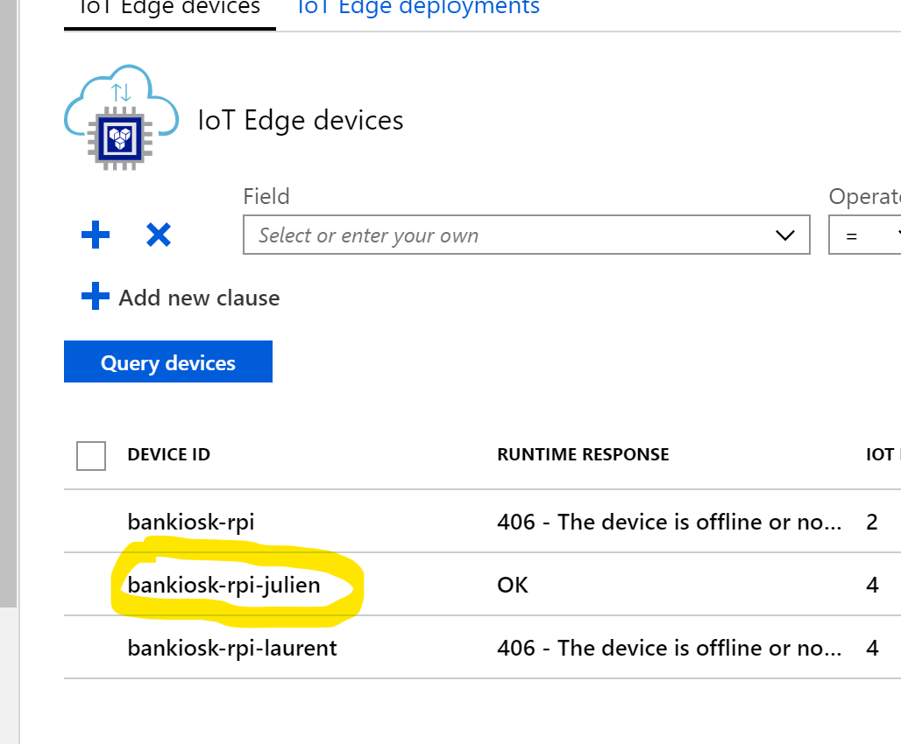

# Bankiosk UI Deployment

This project is the front user exeprience of Bankiosk. It is made in React, and it consumes API from BankioskIoT (which servers as API hub and hardward interface).

To deploy BankioskUI, follow the steps

First, clone the repository

```sh
/> git clone https://https://github.com/jchomarat/Bankiosk/bankioskUI
```

Build the docker image by running the following command

```sh
/> docker build . -t bankiosk/ui
```

For the following, I suppose that you have already 
* Added on your Azure subscription
    * An IoT Hub service, configures for the hardware you are deploying Bankiosk on
    * A Container Registry service to host your docker images.
* A hardware (such as [Raspberry PI 3](https://www.raspberrypi.org/))
    * Ideally 3B+, we haven't tested yet on the 4
    * Raspbian Stretch
    * IoT Edge installed (the guide can be [found](https://docs.microsoft.com/en-us/azure/iot-edge/how-to-install-iot-edge-linux) here)

You can find more information also [here](https://github.com/Ellerbach/Raspberry-IoTEdge#pushing-the-docker-image-to-the-azure-container-registry-acr).

Let's assume that your container registry is called **bankioskcontainersregistry.azurecr.io**

Now, we need to tag our newly generated image

```sh
/> docker tag bankiosk/ui bankioskcontainersregistry.azurecr.io/bankiosk/ui:latest
```

Note that usually I use "latest" as a tag, you can of course set a number here!

Push your tagged image to your container registry on Azure

```sh
/> docker push bankioskcontainersregistry.azurecr.io/bankiosk/ui:latest
```

# Bankiosk UI configuration for IoT Edge

Once everything is deployed, you need to set a few properties on Iot Hub

For that, log onto your [Azure Portal](https://portal.azure.com), then navigate to your IoT Hub service.

From the left menu, click on the **IoT Edge** link


Select then your device you want to set the configuration to



Click on the button "Set modules" in the tool bar. You can see now the list of images to be pushed. Click on the configure button of the Bankiosk UI image


On the right, will load the configuration panel (after to print screen you will find all the settings so that you can simply copy and paste them)


* Name: the one you want
* Image URI: make sure it points to the correct image & version
* Environnement variable: add the following one:

```sh
REACT_APP_BASE_CORE_URL = URL of the BankioskIoT service (see other documentation for that)
```

* Container create option

```json
{
  "ExposedPorts": {
    "3000/tcp": {}
  },
  "HostConfig": {
    "Privileged": true,
    "PortBindings": {
      "3000/tcp": [
        {
          "HostPort": "3000"
        }
      ]
    }
  }
}
```
What is important above is the Privileged and the port (by default it is 3000, but you can off course set something else)


* Module twin's desired properties: leave at it is